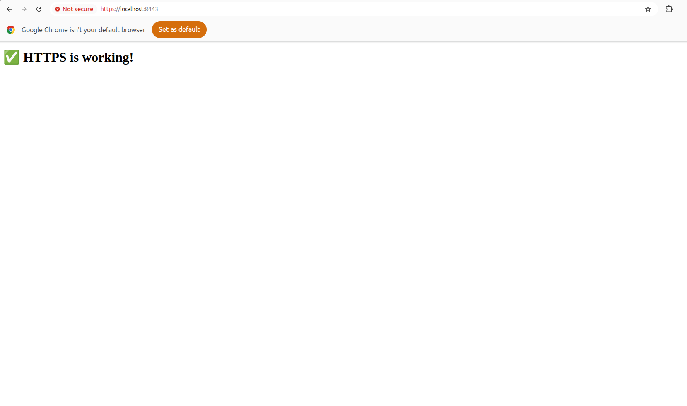

# DAY 4 — SSL + Self-Signed + mkcert + HTTPS

## 🔹 Objective

Set up **HTTPS** locally with NGINX using **self-signed certificates** via `mkcert`, force **HTTP → HTTPS redirect**, and confirm HTTPS works in the browser.

---

## 🔹 Steps Performed

### 1. Install mkcert

```bash
sudo apt install libnss3-tools
# For macOS users:
# brew install mkcert
mkcert -install

2. Generate self-signed certificates

Inside Week5/day4/certs/:

mkcert local.day4.test

Creates:

local.day4.test.pem      # certificate
local.day4.test-key.pem  # private key
3. NGINX Configuration

nginx/default.conf:

server {
    listen 80;
    server_name local.day4.test;
    return 301 https://$host$request_uri;
}

server {
    listen 443 ssl;
    server_name local.day4.test;

    ssl_certificate /etc/ssl/certs/local.day4.test.pem;
    ssl_certificate_key /etc/ssl/certs/local.day4.test-key.pem;

    location / {
        root /usr/share/nginx/html;
        index index.html;
    }
}

HTTP requests redirect to HTTPS.

SSL certificates mounted from certs/ folder.

4. Docker Compose Setup

docker-compose.yml ports mapping:

ports:
  - "8888:80"    # host:container HTTP
  - "8443:443"   # host:container HTTPS

Avoids conflicts with other services using port 80/443.

5. Update /etc/hosts (optional)
127.0.0.1   local.day4.test

Allows access via https://local.day4.test:8443.

6. Start NGINX container
sudo docker compose up -d

Check container running:

docker ps

Confirm NGINX inside container:

docker exec -it day4_nginx sh
pgrep nginx
7. Test HTTPS
Using curl:
curl -v http://localhost:8888   # should return 301 redirect
curl -vk https://localhost:8443 # should return 200 OK with page content
Using browser:

Visit: https://localhost:8443

Or: https://local.day4.test:8443 (with /etc/hosts entry)

⚠️ Browser shows privacy warning due to self-signed certificate — normal for local development.

8. Verification

HTTP → HTTPS redirect confirmed ✅

HTTPS page serving correctly with mkcert certificate ✅

Lock icon appears after trusting mkcert CA (optional) ✅

9. Screenshot

Take a browser screenshot showing:

https://localhost:8443
<h1>✅ HTTPS is working!</h1>

Save it for submission or documentation.



✅ Outcome

Secure local development server running HTTPS

Self-signed certificate via mkcert

HTTP automatically redirects to HTTPS

Ready for DAY 5 exercises


This is fully ready — just create `ssl-setup.md` in `Week5/day4/` and paste it.  
